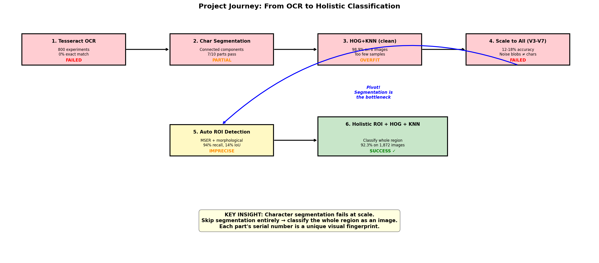
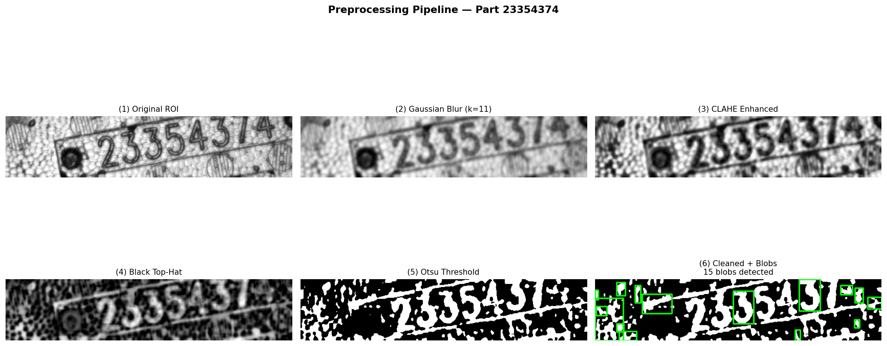
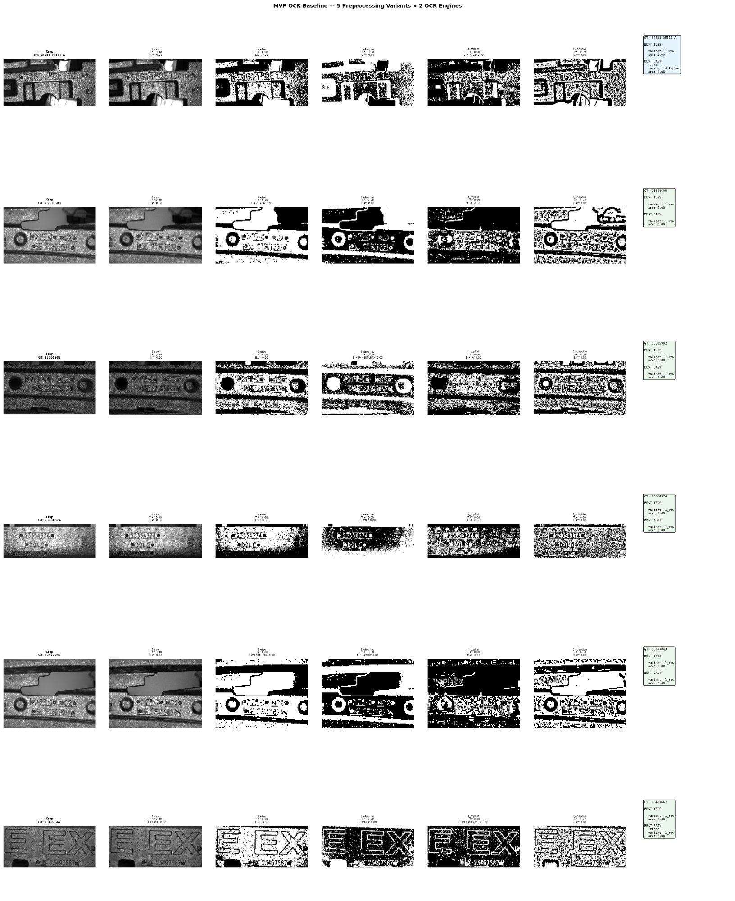

# Cast-Metal Serial Number Recognition

> **OCR scores 0 % on cast-metal stamps. This pipeline hits 96.3 %.**

A classical machine-vision pipeline that identifies cast-metal automotive parts from their stamped serial numbers — where off-the-shelf OCR fails completely because the stamps are recessed valleys in a rough metal texture, not printed characters.

**96.3 % test accuracy · 96.4 % ± 0.6 % GroupKFold · 1,872 images · 10 part types · graded 9.7 / 10** (ENGG\*6100 Machine Vision, University of Guelph).



---

## Results at a glance

| Method | Accuracy |
|---|---|
| **MSER auto-ROI + HOG + KNN (final)** | **96.3 %** |
| GroupKFold cross-validation | 96.4 % ± 0.6 % |
| Manual-ROI baseline | 89.3 % |
| Off-the-shelf OCR (Tesseract, 800 configs) | 0 % |

The headline insight: **dropping binarisation** and feeding HOG the *grayscale* black-top-hat output — plus a loose MSER auto-ROI that captures surrounding casting geometry — beat the obvious "tight crop + binarise" approach by 7 points.

## The pipeline



```
Image → MSER auto-ROI → blur → CLAHE → black top-hat (grayscale)
      → resize 128×64 → HOG (3,780-d) → KNN (k=1) → part type
```

Black top-hat is physics-motivated: stamps are recessed valleys that read as dark depressions regardless of surface brightness, so the transform isolates them while suppressing texture.

## Why OCR fails (and what it took to fix)



The full chronological *tried → failed → learned → pivoted* story — direct thresholding, edge detection, character segmentation, and the eventual holistic-classification pivot — is documented in [`docs/methodology.md`](docs/methodology.md), with per-class results and ablations in [`docs/results.md`](docs/results.md).

## Read more

- 📄 **[Full report (PDF)](report/MV_Project2_FinalReport.pdf)** — the complete graded submission
- 🔬 [Methodology](docs/methodology.md) · [Results](docs/results.md) · [References](docs/references.md)

## A note on code

Solution code is kept private in line with course academic-integrity policy. I'm happy to walk through the implementation, design decisions, and tradeoffs with anyone interested — just reach out.

## Author

**Antony Gerold Arockiasamy** · MEng Computer Engineering, University of Guelph · ENGG\*6100 Machine Vision.

## License

Documentation and figures: MIT — see [LICENSE](LICENSE).
