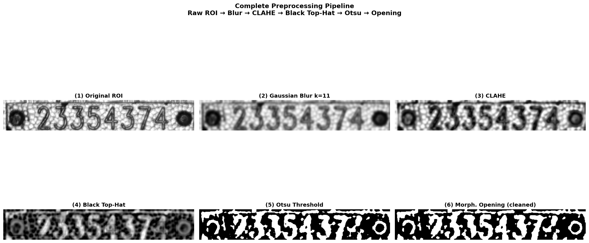
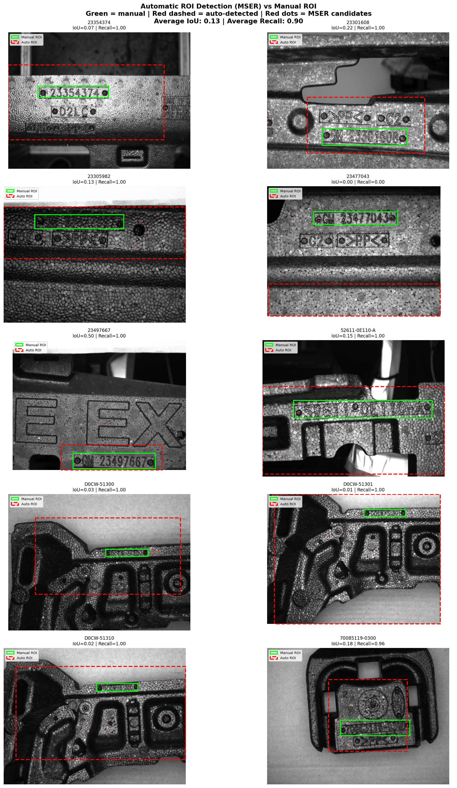
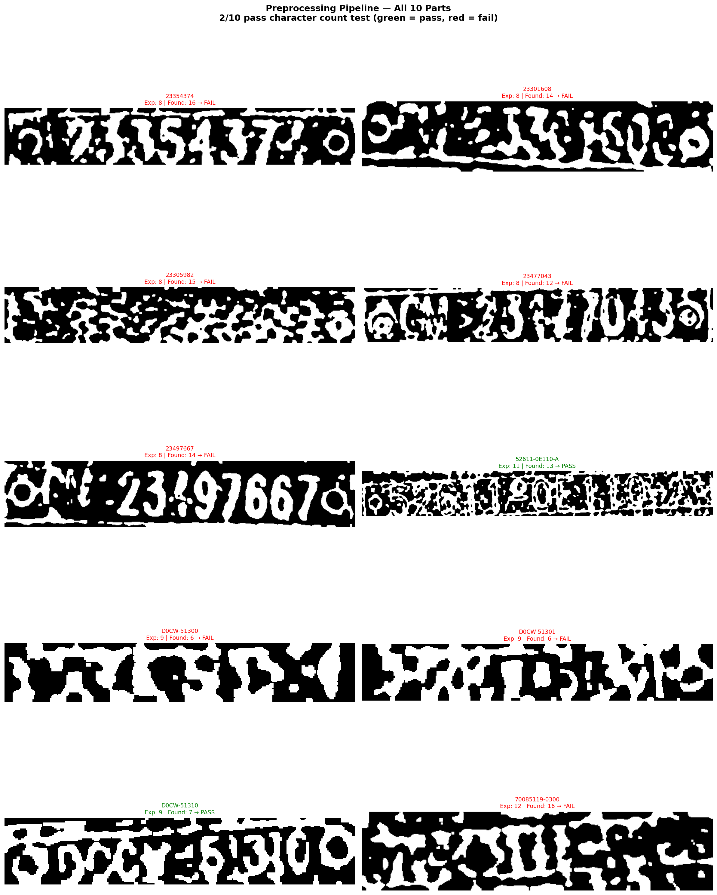

# Cast-Metal Serial Number Recognition

A classical machine vision system that identifies cast-metal automotive parts from their stamped serial numbers. The casting process leaves a rough, bumpy surface, and the serial numbers are pressed into it as shallow grooves. To the camera, the texture and the character strokes have similar intensity and similar edges, so separating them was the main challenge of the project.

**96.3% test accuracy, confirmed by GroupKFold cross-validation at 96.4% ± 0.6%, on 1,872 images across 10 part types** (ENGG\*6100 Machine Vision, University of Guelph).



*Complete preprocessing pipeline on part 23354374: original ROI, Gaussian blur, CLAHE, black top-hat, Otsu threshold, morphological opening (Figure 6 of the report).*

---

## Results at a glance

| Method | Accuracy |
|---|---|
| **Auto ROI (MSER) + HOG + KNN k = 1 (final)** | **96.3%** |
| GroupKFold cross-validation (k = 1) | 96.4% ± 0.6% |
| KNN k = 3 | 93.9% |
| KNN k = 5 | 92.8% |
| Manual ROI (tight) + HOG + KNN k = 1 | 89.3% |

The automatic ROI outperformed the manual ROI by 7 percentage points. The wider MSER region captures visual context around the serial number (screw holes, casting edges, part geometry) that differs between part types, which helps most for the D0CW parts whose serial numbers differ by a single digit.

## The pipeline

```
Image -> MSER auto ROI -> Gaussian blur -> CLAHE -> black top-hat (grayscale)
      -> resize 128x64 -> HOG (3,780-d) -> KNN (k = 1) -> part type
```

The black top-hat transform was chosen because of how stamps physically work: a die presses into soft metal and leaves recessed valleys that appear darker than the surrounding surface. HOG runs on the grayscale top-hat output, not on a binarized image, which preserves the intensity difference between characters and texture.

## Automatic ROI detection



*Automatic ROI detection (red dashed) vs manual ROI (green solid) across all 10 parts (Figure 1 of the report).*

The MSER auto ROI achieved an average recall of 90% and an average IoU of 0.13 against the manual ROI. It captured the serial number for 9 of 10 parts, with 3 to 10 times more background than needed, and missed it entirely for part 23477043.

## Why character segmentation was abandoned



*Preprocessing pipeline applied to all 10 parts. Only 2/10 produce correct blob counts (Figure 7 of the report).*

Direct thresholding and edge detection failed, and character segmentation through connected components produced blob counts within ±2 of the expected character count for only 2 of 10 parts. Binarization destroys the intensity information that separates characters from texture, so the final system classifies the whole serial number region as one image instead. The full chronological story is in [`docs/methodology.md`](docs/methodology.md), with per-class results in [`docs/results.md`](docs/results.md).

## Read more

- **[Full report (PDF)](report/MV_Project2_FinalReport.pdf)**
- [Methodology](docs/methodology.md), [Results](docs/results.md), [References](docs/references.md)

## A note on code

Solution code is kept private in line with course academic-integrity policy. I'm happy to walk through the implementation, design decisions, and tradeoffs with anyone interested.

## Author

**Antony Gerold Arockiasamy**, MEng Computer Engineering, University of Guelph. ENGG\*6100 Machine Vision.

## License

Documentation and figures: MIT, see [LICENSE](LICENSE).
